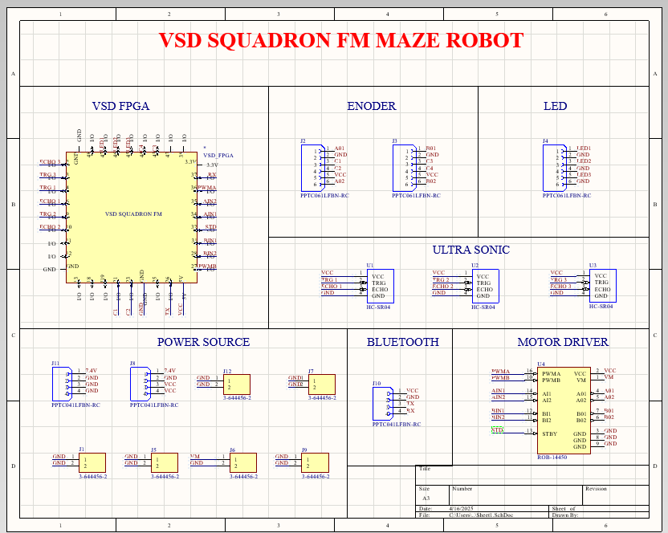
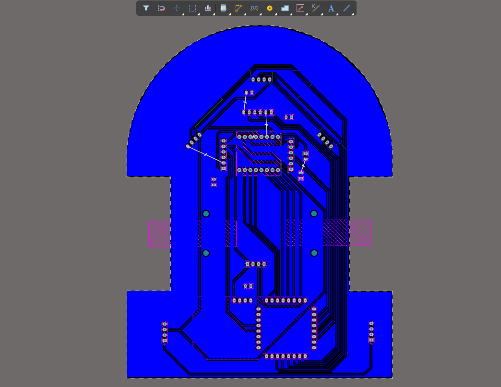
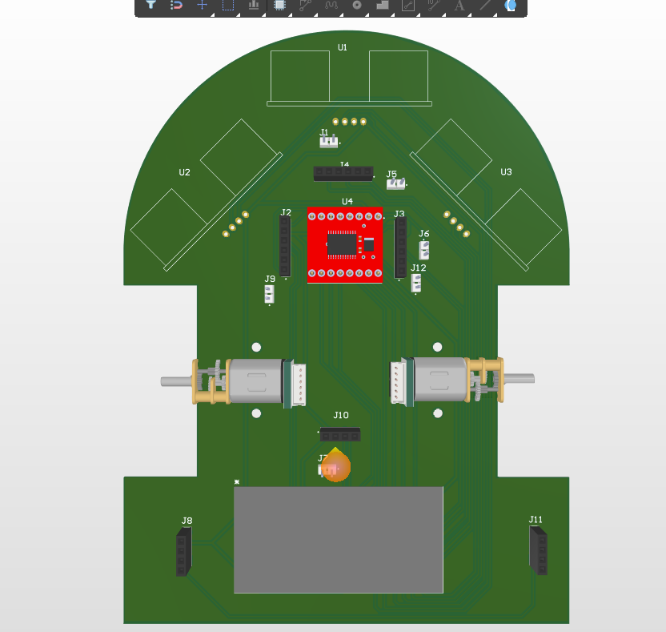
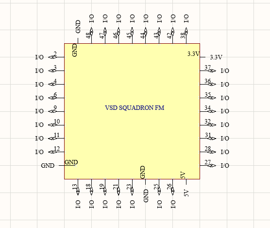

# **📌 Maze-Solving Robot: Custom PCB Footprint & Hardware Design**  
### **FPGA-Based Autonomous Robot with Ultrasonic Navigation & Motor Control**  

---

## **🔍 Project Overview**  
This project involves a **fully custom-designed PCB** for a **maze-solving robot** built around the **VSD Squadron FM FPGA**. The robot autonomously navigates through complex maze environments using:  
- **3x Ultrasonic Sensors** (HC-SR04) for real-time obstacle detection  
- **TB6612FNG Motor Driver** for precise dual-motor control  
- **Quadrature Encoder Motors** for accurate odometry  
- **Bluetooth (HC-05/06)** for wireless monitoring & control  
- **Custom FPGA Footprint** for seamless hardware integration  

---

## 🖼️ Visual Previews

### 1. 📐 Schematic Symbol

> Clean hierarchical layout with labeled I/O banks and global nets.

### 2. 📏 PCB Footprint

> Accurate footprint with verified pad locations and silkscreen pin labels.

### 3. 🧱 3D Model (Optional)

> Optional STEP model can be added for enclosure fitting and mechanical CAD alignment.

### 3. 🧱 3D Model (Optional)

> Optional STEP model can be added for enclosure fitting and mechanical CAD alignment.

### 3. 🧱 3D Model (Optional)

> Optional STEP model can be added for enclosure fitting and mechanical CAD alignment.


---
## **🛠️ Hardware Architecture**  
### **1️⃣ Custom PCB Design Features**  
✔ **Optimized FPGA Footprint** – Designed specifically for the **VSD Squadron FM FPGA** to ensure proper pin-mapping and signal integrity.  
✔ **Dual-Motor Control Circuit** – TB6612FNG-driven H-bridge for **bidirectional PWM motor control**.  
✔ **Multi-Sensor Interface** – Supports **3x HC-SR04 ultrasonic sensors** (front, left, right).  
✔ **Encoder Feedback System** – Quadrature encoder inputs for **precise movement tracking**.  
✔ **Bluetooth UART Communication** – Wireless debugging & manual override capability.  
✔ **Power Regulation** – **5V (sensors, motors) + 3.3V (FPGA, logic)** with noise filtering.  

### **2️⃣ Key Components**  
| Component | Role |  
|-----------|------|  
| **VSD Squadron FM FPGA** | Core logic (pathfinding, sensor fusion) |  
| **TB6612FNG Motor Driver** | Drives 2x DC motors (PWM + direction control) |  
| **HC-SR04 Ultrasonic Sensors (x3)** | Detects walls at 3 angles (180° coverage) |  
| **Encoder Motors (with Hall-effect sensors)** | Tracks wheel rotation for dead-reckoning |  
| **HC-05 Bluetooth Module** | Wireless telemetry & manual control |  
| **Custom PCB** | Unifies all components with minimal wiring |  

---

## **📂 Repository Structure**  
```
├── **/Hardware/**  
│   ├── Schematic (PDF/KiCad)  
│   ├── PCB Layout (Gerber files + 3D preview)  
│   ├── **Custom Footprints** (FPGA, motor driver, sensors)  
│   └── BOM (Bill of Materials)  
├── **/Firmware/**  
│   ├── FPGA (Verilog/VHDL for maze-solving logic)  
│   └── Microcontroller (C++ for sensor/motor control)  
├── **/Mechanical/**  
│   ├── Robot Chassis (STL for 3D printing)  
│   └── Mounting Guides  
└── **/Documentation/**  
    ├── Datasheets (FPGA, TB6612FNG, HC-SR04)  
    └── Maze-Solving Algorithm Explanation  
```

---

## **🤖 How the Robot Works**  
### **1. Sensing Phase**  
- Ultrasonic sensors scan **front, left, and right** distances at 20Hz.  
- Encoders measure **wheel rotation** to calculate distance traveled.  

### **2. Decision-Making (FPGA Logic)**  
- Implements **Flood Fill Algorithm** or **Right-Hand Rule** for maze-solving.  
- Processes sensor data to **update the maze map** in real-time.  

### **3. Motor Control**  
- FPGA sends **PWM signals** to the TB6612FNG for:  
  - **Forward/Reverse motion**  
  - **Precise turns (90° / 180°)**  
  - **Speed adjustment** based on error feedback  

### **4. Wireless Debugging (Optional)**  
- Bluetooth module transmits:  
  - Sensor readings  
  - Maze map updates  
  - Motor speed diagnostics  

---

## **⚙️ Setup & Calibration**  
1. **Assemble the PCB**  
   - Solder components following the **schematic & BOM**.  
   - Verify **power rails** (5V, 3.3V) before connecting FPGA.  

2. **Upload Firmware**  
   - Program the FPGA with **maze-solving logic** (Verilog/VHDL).  
   - Flash the microcontroller (if used) for **sensor/motor control**.  

3. **Calibrate Sensors & Motors**  
   - Adjust **ultrasonic sensor thresholds** (min/max range).  
   - Tune **PID constants** for motor control (if using encoders).  

4. **Test in Maze Environment**  
   - Start with **simple mazes** (no loops).  
   - Gradually increase complexity (dead-ends, loops).  

---

## **📜 License & Collaboration**  
- **Open-source (MIT License)** – Modify, distribute, or commercialize freely.  
- **Contributions welcome!** Submit PRs for:  
  - Improved FPGA logic  
  - Better PCB layout optimizations  
  - Alternative maze algorithms  

---

## **📧 Contact**  
For questions or collaboration requests:  
- **Email:** [Your Email]  
- **GitHub:** [Your Profile Link]  

---

### **🚀 Let’s Build the Future of Autonomous Robots!**  
🔧 **PCB Designers** → Focus on signal integrity & miniaturization.  
🧠 **FPGA Developers** → Optimize pathfinding algorithms.  
🤖 **Robotics Enthusiasts** → Test in real-world mazes!  

**Happy Building!** 🎯